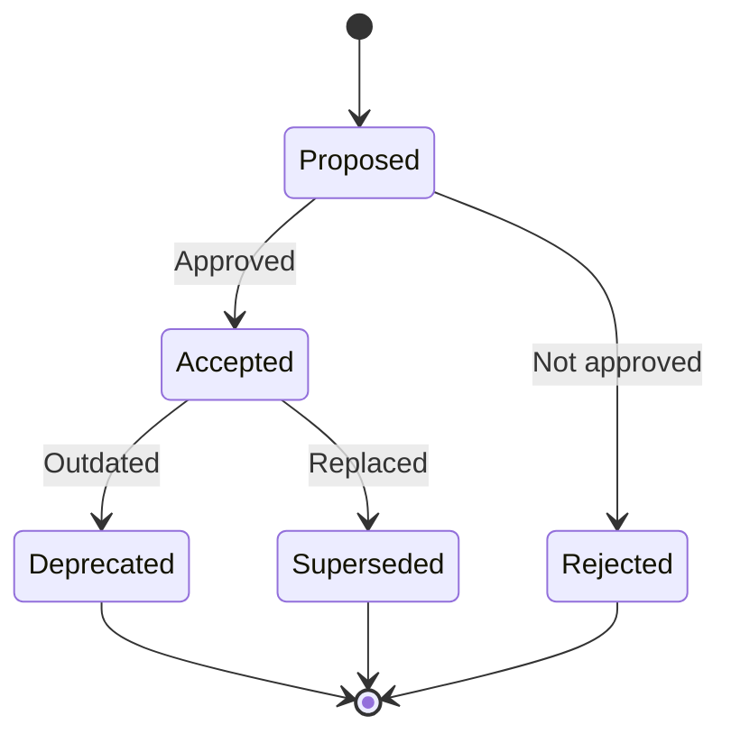

# ADR Patterns

Полное руководство по Architecture Decision Records — документирование, управление и governance архитектурных решений уровня enterprise.

## Поддержка языков

- **Русский ввод** → Объяснения и примеры на **русском**
- **English input** → Explanations and examples in **English**
- Технические термины сохраняются в оригинале

**ВСЕ РЕЗУЛЬТАТЫ СОХРАНЯЮТСЯ В MARKDOWN НА РУССКОМ ЯЗЫКЕ**

## Когда использовать этот скилл

- Документирование архитектурных решений
- Создание системы ADR для команды/организации
- Настройка процесса принятия решений
- Ревью существующих архитектурных решений
- Миграция legacy решений в ADR формат
- Обучение команды практикам ADR

## Основные концепции

### Что такое ADR?

**Architecture Decision Record (ADR)** — короткий документ, фиксирующий важное архитектурное решение вместе с контекстом и последствиями.

### Принципы ADR

1. **Immutable** — ADR не редактируются после принятия, только supersede
2. **Lightweight** — Краткий формат, минимум бюрократии
3. **Version-controlled** — Хранятся в Git вместе с кодом
4. **Context-rich** — Фиксируют контекст принятия решения
5. **Linked** — Связаны между собой и с кодом

### Когда нужен ADR?

| Ситуация | Нужен ADR? |
|----------|------------|
| Выбор базы данных | ✅ Да |
| Выбор между REST и GraphQL | ✅ Да |
| Изменение стратегии кэширования | ✅ Да |
| Рефакторинг внутри модуля | ❌ Нет |
| Добавление нового endpoint | ❌ Нет |
| Изменение naming convention | ⚠️ Возможно |

**Правило:** Если решение влияет на несколько компонентов или его сложно отменить — нужен ADR.

## Шаблоны ADR

### MADR (Markdown Any Decision Records)

Наиболее популярный формат с богатым tooling.

```markdown
# ADR-0001: [Краткое название решения]

## Статус

[Proposed | Accepted | Deprecated | Superseded by [ADR-XXXX](./xxxx-*.md)]

## Контекст

[Описание ситуации, которая требует решения. Какие факторы влияют? Какие ограничения существуют?]

## Решение

[Принятое решение в императивной форме]

## Последствия

### Положительные

- [Положительное последствие 1]
- [Положительное последствие 2]

### Отрицательные

- [Отрицательное последствие 1]
- [Отрицательное последствие 2]

## Альтернативы рассмотренные

### [Альтернатива 1]

[Краткое описание и причина отклонения]

### [Альтернатива 2]

[Краткое описание и причина отклонения]
```

### Extended MADR

Расширенный формат для сложных решений.

```markdown
# ADR-0042: Переход на Event Sourcing для Order Service

## Статус

Accepted

## Дата принятия

2024-01-15

## Авторы

- Иван Петров (@ivan.petrov)
- Мария Сидорова (@maria.sidorova)

## Ревьюеры

- Алексей Козлов (@alexey.kozlov) — Platform Architect
- Дмитрий Волков (@dmitry.volkov) — Staff Engineer

## Контекст

### Бизнес-контекст

Система обработки заказов обрабатывает 50,000 заказов в день.
Бизнес требует:
- Полный аудит всех изменений для compliance (SOX, GDPR)
- Возможность воссоздать состояние заказа на любой момент времени
- Real-time уведомления о изменениях для интегрированных систем

### Технический контекст

Текущая архитектура:
- CRUD модель с PostgreSQL
- Отдельная таблица audit_log для истории
- Polling-based интеграция (каждые 30 секунд)

Проблемы:
- Audit log рассинхронизируется при ошибках
- Невозможно воссоздать промежуточные состояния
- Polling создаёт задержку до 30 секунд

### Driving Forces

- [DF-1] Требование compliance: полная история изменений
- [DF-2] Бизнес: real-time интеграции (< 1 секунда)
- [DF-3] Техническая: устранение дублирования audit logic

## Решение

Перевести Order Service на Event Sourcing архитектуру:

1. Все изменения состояния заказа представляются как events
2. Event Store (PostgreSQL + Kafka) как primary storage
3. CQRS для разделения read и write моделей
4. Projections для построения read models

### Архитектура

```
┌─────────────────┐
│  Order Command  │
│     Handler     │
└────────┬────────┘
         │
         ▼
┌─────────────────┐    ┌─────────────────┐
│   Order Aggr.   │───▶│   Event Store   │
│                 │    │  (PostgreSQL)   │
└─────────────────┘    └────────┬────────┘
                                │
                                ▼
                       ┌─────────────────┐
                       │     Kafka       │
                       │  (order.events) │
                       └────────┬────────┘
                                │
              ┌─────────────────┼─────────────────┐
              ▼                 ▼                 ▼
     ┌─────────────────┐ ┌─────────────┐ ┌─────────────────┐
     │   Order Read    │ │  Analytics  │ │  Notifications  │
     │     Model       │ │   Service   │ │     Service     │
     └─────────────────┘ └─────────────┘ └─────────────────┘
```

### Event Design

```typescript
type OrderEvent =
  | { type: 'OrderCreated'; customerId: string; items: OrderItem[] }
  | { type: 'ItemAdded'; productId: string; quantity: number }
  | { type: 'ItemRemoved'; productId: string }
  | { type: 'OrderSubmitted'; submittedAt: string }
  | { type: 'PaymentReceived'; amount: number; transactionId: string }
  | { type: 'OrderShipped'; trackingNumber: string }
  | { type: 'OrderDelivered'; deliveredAt: string }
  | { type: 'OrderCancelled'; reason: string };
```

## Последствия

### Положительные

1. **Полная история** — каждое изменение сохранено как event
2. **Time travel** — можно воссоздать состояние на любой момент
3. **Real-time интеграция** — события доставляются через Kafka за < 100ms
4. **Audit trail** — built-in, не нужна отдельная логика
5. **Debug** — можно replay events для воспроизведения проблем

### Отрицательные

1. **Complexity** — команде нужно изучить Event Sourcing
2. **Eventual consistency** — read model может отставать
3. **Event schema evolution** — нужна стратегия версионирования
4. **Storage growth** — events accumulate, нужны snapshots

### Нейтральные

1. Требуется обновление runbooks
2. Новые dashboards для мониторинга
3. Изменение процесса on-call

## Альтернативы рассмотренные

### Альтернатива A: CDC (Change Data Capture)

**Описание:** Использовать Debezium для capture изменений из PostgreSQL

**Плюсы:**
- Минимальные изменения в коде
- Работает с существующей схемой

**Минусы:**
- Теряется бизнес-контекст изменений
- Зависимость от структуры таблиц
- Нельзя воссоздать промежуточные состояния

**Причина отклонения:** Не решает requirement DF-1 (полная история с бизнес-контекстом)

### Альтернатива B: Улучшенный Audit Log

**Описание:** Усилить текущий audit log с транзакционностью

**Плюсы:**
- Минимальные изменения
- Знакомая модель

**Минусы:**
- Дублирование логики сохраняется
- Polling-based интеграция остаётся
- Не решает time travel requirement

**Причина отклонения:** Не решает requirements DF-2 и DF-3

### Альтернатива C: Full CQRS без Event Sourcing

**Описание:** Разделить read/write модели без event store

**Плюсы:**
- Проще Event Sourcing
- Решает проблему производительности

**Минусы:**
- Не даёт полную историю
- Нужен отдельный audit механизм

**Причина отклонения:** Не решает requirement DF-1

## Связанные решения

- [ADR-0040](./0040-postgresql-event-store.md) — Выбор PostgreSQL для Event Store
- [ADR-0041](./0041-kafka-event-bus.md) — Kafka как event bus
- [ADR-0043](./0043-event-versioning-strategy.md) — Стратегия версионирования events

## Ссылки

- [Event Sourcing Pattern](https://microservices.io/patterns/data/event-sourcing.html)
- [Martin Fowler: Event Sourcing](https://martinfowler.com/eaaDev/EventSourcing.html)
- [PoC Results](../poc/event-sourcing-poc.md)
- [Performance Benchmarks](../benchmarks/event-sourcing-performance.md)

## Notes

- Training session запланирована на 2024-01-22
- Migration будет выполнена в 3 фазы (см. RFC-2024-005)
```

### Y-Statement Template

Компактный формат для быстрых решений.

```markdown
# ADR-0015: Выбор Redis для кэширования

## Y-Statement

В контексте **системы каталога товаров с 100K RPS на чтение**,
принимая во внимание **требования по latency < 10ms и high availability**,
мы решили использовать **Redis Cluster**
вместо **Memcached**,
чтобы достичь **sub-millisecond latency и automatic failover**,
принимая во внимание **increased operational complexity**.

## Детали

[Опционально: расширенное описание если нужно]
```

### Nygard Template (Original)

Оригинальный формат от Michael Nygard.

```markdown
# ADR-0001: Record architecture decisions

## Status

Accepted

## Context

We need to record the architectural decisions made on this project.

## Decision

We will use Architecture Decision Records, as described by Michael Nygard.

## Consequences

See Michael Nygard's article, linked above.
```

## ADR Tools

### adr-tools

Классический CLI для управления ADR.

```bash
# Установка
brew install adr-tools  # macOS
pip install adr-tools   # Python

# Инициализация
adr init docs/adr

# Создание нового ADR
adr new "Use PostgreSQL for user data"
# Создаёт: docs/adr/0001-use-postgresql-for-user-data.md

# Создание связанного ADR
adr new -s 5 "Replace RabbitMQ with Kafka"
# Supersedes ADR-0005

# Генерация оглавления
adr generate toc > docs/adr/README.md

# Генерация графа зависимостей
adr generate graph | dot -Tpng > docs/adr/graph.png

# Связывание ADR
adr link 7 "Clarifies" 3 "Clarified by"
```

### Log4brains

Современный инструмент с web UI.

```bash
# Установка
npm install -g log4brains

# Инициализация
log4brains init

# Создание ADR
log4brains adr new "Use event sourcing for orders"

# Запуск preview
log4brains preview

# Build статического сайта
log4brains build

# Deploy на GitHub Pages
log4brains build --basePath /my-repo
```

Конфигурация `.log4brains.yml`:

```yaml
project:
  name: "Order Platform"
  tz: "Europe/Moscow"
  adrFolder: "./docs/adr"

repository:
  url: "https://github.com/company/order-platform"
  viewUrl: "https://github.com/company/order-platform/blob/main/%path"

log4brains:
  branch: "main"

# Кастомные статусы
statuses:
  - label: "Proposed"
    color: "#0066cc"
  - label: "Accepted"
    color: "#00cc66"
  - label: "Deprecated"
    color: "#cc6600"
  - label: "Superseded"
    color: "#666666"
```

### ADR Manager (VS Code)

Extension для Visual Studio Code.

```json
// .vscode/settings.json
{
  "adrManager.adrPath": "docs/adr",
  "adrManager.template": "madr",
  "adrManager.prefixDigits": 4
}
```

## Governance

### ADR Review Process

```yaml
# .github/workflows/adr-review.yml
name: ADR Review

on:
  pull_request:
    paths:
      - 'docs/adr/**'

jobs:
  validate-format:
    runs-on: ubuntu-latest
    steps:
      - uses: actions/checkout@v4

      - name: Validate ADR format
        run: |
          for file in docs/adr/[0-9]*.md; do
            echo "Validating $file"

            # Check required sections
            grep -q "^## Статус" "$file" || \
              (echo "Missing Status in $file" && exit 1)
            grep -q "^## Контекст" "$file" || \
              (echo "Missing Context in $file" && exit 1)
            grep -q "^## Решение" "$file" || \
              (echo "Missing Decision in $file" && exit 1)
            grep -q "^## Последствия" "$file" || \
              (echo "Missing Consequences in $file" && exit 1)
          done

      - name: Check numbering
        run: |
          # Ensure sequential numbering
          expected=1
          for file in docs/adr/[0-9]*.md; do
            num=$(echo "$file" | grep -oE '[0-9]+' | head -1)
            if [ "$num" != "$(printf '%04d' $expected)" ]; then
              echo "Gap in numbering at $expected"
            fi
            expected=$((expected + 1))
          done

  require-architect-approval:
    runs-on: ubuntu-latest
    steps:
      - name: Check for architect approval
        uses: actions/github-script@v6
        with:
          script: |
            const reviews = await github.rest.pulls.listReviews({
              owner: context.repo.owner,
              repo: context.repo.repo,
              pull_number: context.issue.number
            });

            const architectApproval = reviews.data.some(
              r => r.state === 'APPROVED' &&
                   ['architect1', 'architect2'].includes(r.user.login)
            );

            if (!architectApproval) {
              core.setFailed('ADR requires architect approval');
            }
```

### PR Template для ADR

```markdown
<!-- .github/PULL_REQUEST_TEMPLATE/adr.md -->

## ADR Submission

### Checklist

- [ ] ADR follows the standard template
- [ ] All required sections are filled
- [ ] Alternatives are documented
- [ ] Consequences (positive and negative) are listed
- [ ] Related ADRs are linked
- [ ] Status is "Proposed"

### Summary

[Brief summary of the decision]

### Impact

- [ ] Affects single service
- [ ] Affects multiple services
- [ ] Affects external APIs
- [ ] Requires data migration
- [ ] Breaking change

### Reviewers

@architects Please review this ADR.
```

### Decision Log

Tracking всех решений.

```markdown
# Architecture Decision Log

| ID | Title | Status | Date | Authors |
|----|-------|--------|------|---------|
| [ADR-0042](./0042-event-sourcing.md) | Event Sourcing для Orders | Accepted | 2024-01-15 | @ivan |
| [ADR-0041](./0041-kafka-event-bus.md) | Kafka как Event Bus | Accepted | 2024-01-10 | @maria |
| [ADR-0040](./0040-postgresql-event-store.md) | PostgreSQL Event Store | Accepted | 2024-01-08 | @ivan |
| [ADR-0005](./0005-rabbitmq.md) | RabbitMQ для messaging | Superseded | 2023-06-01 | @alex |

## По категориям

### Data

- [ADR-0040](./0040-postgresql-event-store.md) — PostgreSQL Event Store
- [ADR-0012](./0012-redis-caching.md) — Redis для кэширования

### Integration

- [ADR-0041](./0041-kafka-event-bus.md) — Kafka как Event Bus
- [ADR-0005](./0005-rabbitmq.md) — ~~RabbitMQ~~ (superseded)

### Architecture

- [ADR-0042](./0042-event-sourcing.md) — Event Sourcing
```

## Паттерны

### Linking ADRs

```markdown
## Связанные решения

- **Amends:** [ADR-0003](./0003-*.md) — Уточняет предыдущее решение
- **Supersedes:** [ADR-0001](./0001-*.md) — Заменяет устаревшее решение
- **Implements:** [RFC-2024-005](../rfc/rfc-2024-005.md) — Реализует RFC
- **Requires:** [ADR-0010](./0010-*.md) — Зависит от другого решения
- **Enables:** [ADR-0015](./0015-*.md) — Делает возможным другое решение
```

### ADR Lifecycle



### Code References

Связь ADR с кодом через комментарии.

```python
# service/orders/event_store.py

class OrderEventStore:
    """
    Event store implementation for Order aggregate.

    Architecture Decision: ADR-0042
    See: docs/adr/0042-event-sourcing.md

    This implementation follows the Event Sourcing pattern
    to maintain a complete audit trail of all order changes.
    """

    def append(self, aggregate_id: str, events: list[Event]) -> None:
        # ADR-0042: All state changes stored as events
        ...
```

## Ресурсы

- **references/adr-templates-collection.md** — Коллекция шаблонов
- **references/adr-tools-comparison.md** — Сравнение инструментов
- **assets/adr-template-madr.md** — MADR шаблон
- **assets/adr-review-checklist.md** — Чеклист для ревью

## Частые ошибки

1. **Слишком длинные ADR** — ADR должен быть 1-2 страницы максимум
2. **Редактирование принятых ADR** — Создавайте новый ADR вместо редактирования
3. **Отсутствие альтернатив** — Всегда документируйте рассмотренные варианты
4. **Игнорирование отрицательных последствий** — Будьте честны о trade-offs
5. **ADR без контекста** — Контекст критичен для понимания решения в будущем
