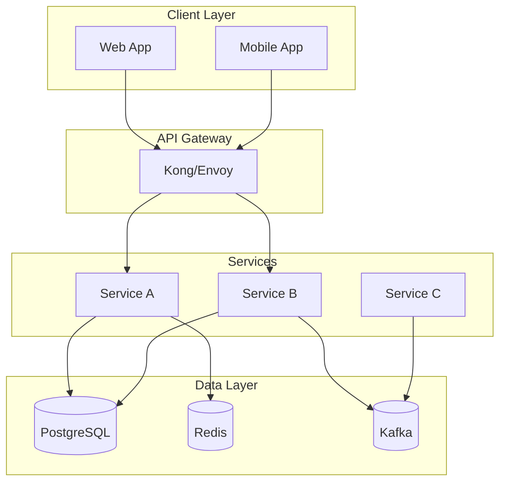
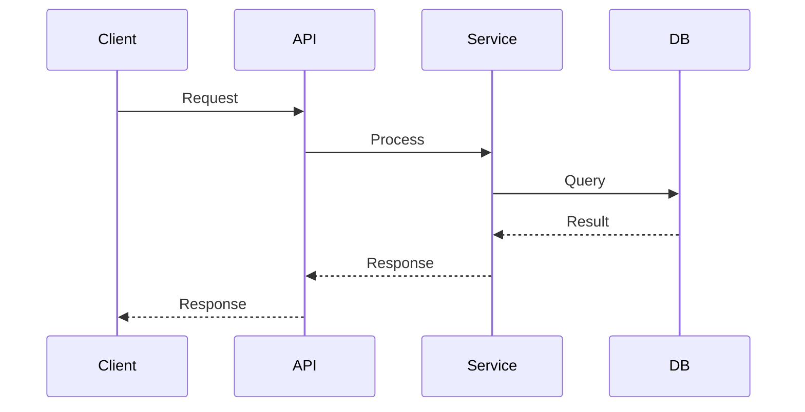
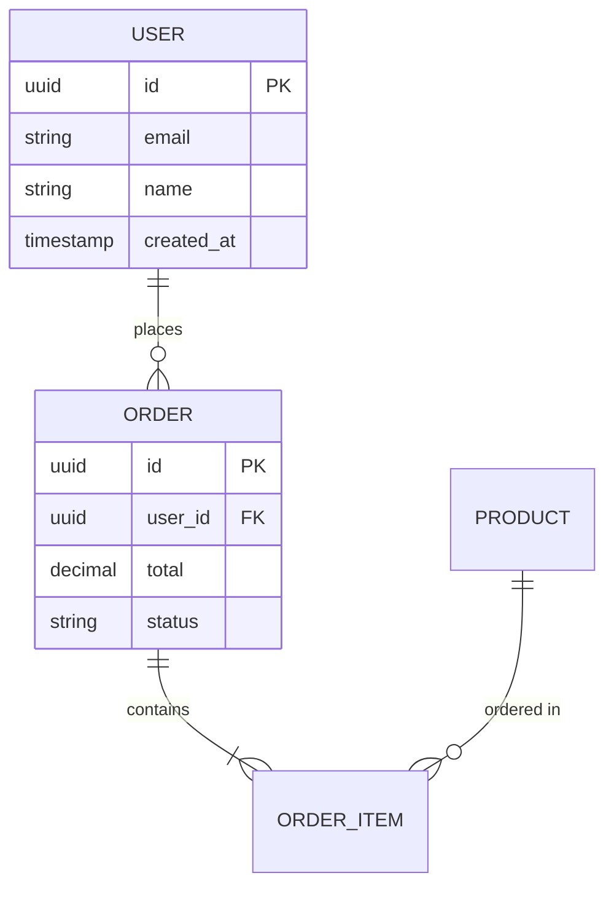
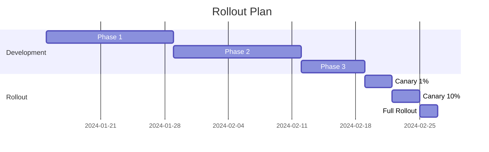

# Design Documents Mastery

Полное руководство по созданию дизайн-документов уровня Google, Amazon, Microsoft, Stripe — от one-pagers до полных RFC и Technical Design Documents.

## Поддержка языков

- **Русский ввод** → Объяснения и примеры на **русском**
- **English input** → Explanations and examples in **English**
- Технические термины сохраняются в оригинале

**ВСЕ РЕЗУЛЬТАТЫ СОХРАНЯЮТСЯ В MARKDOWN НА РУССКОМ ЯЗЫКЕ**

## Когда использовать этот скилл

- Проектирование новых систем и функций
- Документирование крупных изменений архитектуры
- Создание RFC для обсуждения в команде
- Подготовка proposal для stakeholders
- Формализация технических решений
- Координация между командами

## Основные концепции

### Типы документов

| Тип | Размер | Аудитория | Когда использовать |
|-----|--------|-----------|-------------------|
| One-Pager | 1 страница | Team lead, PM | Быстрые решения, небольшие фичи |
| Mini RFC | 2-3 страницы | Команда | Локальные изменения |
| Standard RFC | 5-10 страниц | Несколько команд | Межкомандные изменения |
| Full Design Doc | 10-20 страниц | Архитекторы | Крупные системы |
| 6-Pager (Amazon) | 6 страниц | Executives | Стратегические решения |

### Lifecycle дизайн-документа

```
┌────────────┐    ┌────────────┐    ┌────────────┐
│   Draft    │───▶│   Review   │───▶│  Approved  │
└────────────┘    └────────────┘    └────────────┘
                        │                  │
                        ▼                  ▼
                  ┌────────────┐    ┌────────────┐
                  │  Rejected  │    │ Implemented│
                  └────────────┘    └────────────┘
                                          │
                                          ▼
                                   ┌────────────┐
                                   │  Obsolete  │
                                   └────────────┘
```

## Шаблоны документов

### One-Pager Template

```markdown
# [Название проекта]

**Автор:** [Имя]
**Дата:** [YYYY-MM-DD]
**Статус:** Draft | Review | Approved

## Проблема

[1-2 предложения описывающие проблему]

## Предлагаемое решение

[2-3 предложения с высокоуровневым описанием решения]

## Ключевые метрики

- [Метрика 1]: текущее значение → целевое значение
- [Метрика 2]: текущее значение → целевое значение

## Риски

1. [Риск 1] — [Митигация]
2. [Риск 2] — [Митигация]

## Следующие шаги

- [ ] [Действие 1]
- [ ] [Действие 2]
- [ ] [Действие 3]

## Открытые вопросы

1. [Вопрос]
```

### Google-Style Design Doc

```markdown
# Design Doc: [Название системы/функции]

## Метаданные

| Поле | Значение |
|------|----------|
| **Авторы** | @author1, @author2 |
| **Ревьюеры** | @reviewer1, @reviewer2 |
| **Статус** | Draft / In Review / Approved / Obsolete |
| **Создано** | YYYY-MM-DD |
| **Обновлено** | YYYY-MM-DD |
| **Связанные документы** | [Doc 1](link), [Doc 2](link) |

---

## Содержание

1. [Overview](#overview)
2. [Background](#background)
3. [Goals and Non-Goals](#goals-and-non-goals)
4. [Design](#design)
5. [Alternatives Considered](#alternatives-considered)
6. [Cross-cutting Concerns](#cross-cutting-concerns)
7. [Implementation Plan](#implementation-plan)
8. [Open Questions](#open-questions)

---

## Overview

### Objective

[Краткое описание цели проекта в 2-3 предложениях. Что мы строим и зачем?]

### Summary

[Краткое резюме предлагаемого решения. Должно быть понятно без чтения остального документа.]

---

## Background

### Context

[Описание текущей ситуации и контекста]

- Какая система существует сейчас?
- Какие у неё ограничения?
- Что изменилось (требования, нагрузка, бизнес)?

### Problem Statement

[Чёткая формулировка проблемы, которую решаем]

### User Stories

```gherkin
Как [роль пользователя]
Я хочу [действие/функция]
Чтобы [бизнес-результат]
```

### Prior Art

[Ссылки на существующие решения, исследования, альтернативные подходы]

---

## Goals and Non-Goals

### Goals

1. ✅ [Goal 1] — Конкретная, измеримая цель
2. ✅ [Goal 2] — Конкретная, измеримая цель
3. ✅ [Goal 3] — Конкретная, измеримая цель

### Non-Goals

1. ❌ [Non-Goal 1] — Что явно НЕ входит в scope
2. ❌ [Non-Goal 2] — Что откладывается на будущее
3. ❌ [Non-Goal 3] — Что решается другим проектом

### Success Metrics

| Метрика | Текущее | Целевое | Способ измерения |
|---------|---------|---------|------------------|
| [Metric 1] | X | Y | [Dashboard/Query] |
| [Metric 2] | X | Y | [Dashboard/Query] |

---

## Design

### High-Level Architecture

```
[ASCII или Mermaid диаграмма архитектуры]
```



### Detailed Design

#### Component 1: [Название]

**Responsibility:**
[Описание ответственности компонента]

**API:**
```yaml
# OpenAPI или описание интерфейса
```

**Data Model:**
```sql
-- Схема данных
CREATE TABLE example (
    id UUID PRIMARY KEY,
    ...
);
```

**Sequence Diagram:**


#### Component 2: [Название]

[Аналогичная структура]

### API Design

```yaml
# OpenAPI спецификация ключевых endpoints
paths:
  /api/v1/resource:
    post:
      summary: Create resource
      requestBody:
        content:
          application/json:
            schema:
              $ref: '#/components/schemas/CreateRequest'
      responses:
        '201':
          description: Created
```

### Data Model



---

## Alternatives Considered

### Alternative A: [Название]

**Description:**
[Краткое описание альтернативы]

**Pros:**
- [Преимущество 1]
- [Преимущество 2]

**Cons:**
- [Недостаток 1]
- [Недостаток 2]

**Reason for Rejection:**
[Почему не выбрали этот вариант]

### Alternative B: [Название]

[Аналогичная структура]

### Comparison Matrix

| Критерий | Предложенное | Alt A | Alt B |
|----------|--------------|-------|-------|
| Performance | ⭐⭐⭐ | ⭐⭐ | ⭐ |
| Complexity | ⭐⭐ | ⭐ | ⭐⭐⭐ |
| Cost | ⭐⭐ | ⭐⭐⭐ | ⭐ |
| Time to Market | ⭐⭐⭐ | ⭐⭐ | ⭐ |

---

## Cross-cutting Concerns

### Security

**Authentication:**
[Описание механизма аутентификации]

**Authorization:**
[Описание механизма авторизации]

**Data Protection:**
[Шифрование, маскирование, retention policies]

**Threat Model:**
| Угроза | Вероятность | Влияние | Митигация |
|--------|-------------|---------|-----------|
| [Threat 1] | High | High | [Mitigation] |

### Scalability

**Current Load:**
- Requests: X RPS
- Data size: Y GB
- Users: Z

**Expected Load (1 year):**
- Requests: X * 10 RPS
- Data size: Y * 5 GB
- Users: Z * 3

**Scaling Strategy:**
[Horizontal/Vertical scaling, sharding, caching]

### Reliability

**SLOs:**
| SLI | SLO | Current |
|-----|-----|---------|
| Availability | 99.9% | 99.95% |
| Latency (p99) | < 200ms | 150ms |
| Error Rate | < 0.1% | 0.05% |

**Failure Modes:**
[Описание возможных сбоев и поведения системы]

**Disaster Recovery:**
[RTO, RPO, backup strategy]

### Observability

**Metrics:**
- [Metric 1]: [Description]
- [Metric 2]: [Description]

**Logs:**
- [Log type 1]: [Purpose]
- [Log type 2]: [Purpose]

**Traces:**
[Distributed tracing approach]

**Alerts:**
| Alert | Condition | Severity | Action |
|-------|-----------|----------|--------|
| [Alert 1] | [Condition] | Critical | [Action] |

### Privacy

**PII Handling:**
[Какие PII данные обрабатываются]

**GDPR Compliance:**
[Как обеспечивается compliance]

**Data Retention:**
[Политика хранения данных]

---

## Implementation Plan

### Phases

#### Phase 1: Foundation (Week 1-2)

**Deliverables:**
- [ ] Database schema
- [ ] Basic API endpoints
- [ ] Unit tests

**Exit Criteria:**
- [ ] Code reviewed and merged
- [ ] CI/CD pipeline working

#### Phase 2: Core Features (Week 3-4)

**Deliverables:**
- [ ] [Feature 1]
- [ ] [Feature 2]
- [ ] Integration tests

**Exit Criteria:**
- [ ] Feature complete
- [ ] Performance tested

#### Phase 3: Production Readiness (Week 5)

**Deliverables:**
- [ ] Monitoring dashboards
- [ ] Runbooks
- [ ] Load testing

**Exit Criteria:**
- [ ] SLOs met
- [ ] Security review passed

### Rollout Strategy



**Canary Rollout:**
1. 1% traffic → Monitor 24h
2. 10% traffic → Monitor 24h
3. 50% traffic → Monitor 24h
4. 100% traffic

**Rollback Plan:**
[Описание процедуры отката]

---

## Open Questions

1. **[Вопрос 1]**
   - Context: [Контекст]
   - Options: [Варианты]
   - Decision needed by: [Дата]

2. **[Вопрос 2]**
   - Context: [Контекст]
   - Options: [Варианты]
   - Decision needed by: [Дата]

---

## Appendices

### Appendix A: Glossary

| Term | Definition |
|------|------------|
| [Term 1] | [Definition] |
| [Term 2] | [Definition] |

### Appendix B: References

- [Reference 1](link)
- [Reference 2](link)

### Appendix C: Change Log

| Date | Author | Changes |
|------|--------|---------|
| YYYY-MM-DD | @author | Initial draft |
| YYYY-MM-DD | @author | Addressed review comments |
```

### Amazon 6-Pager

```markdown
# [Название инициативы]

## Введение

[2-3 параграфа введения. Описание ситуации, проблемы и предлагаемого решения в narrative формате. Читатель должен понять суть после прочтения введения.]

Например:

> Сегодня обработка заказов в нашей системе занимает в среднем 2.5 секунды. При текущем росте в 40% год-к-году мы достигнем предела производительности через 8 месяцев. Клиенты уже жалуются на медленное оформление — NPS упал с 72 до 65 за последний квартал.
>
> Мы предлагаем переработать систему обработки заказов с использованием event-driven архитектуры. Это позволит сократить время обработки до 200ms и масштабироваться до 10x текущей нагрузки.

---

## Текущее состояние

### Архитектура

[Описание текущей архитектуры. Диаграммы, компоненты, data flow.]

### Проблемы

**Проблема 1: [Название]**

[Детальное описание проблемы с данными и примерами]

- Метрика: текущее значение
- Влияние на бизнес: [описание]
- Trend: [ухудшается/стабильно]

**Проблема 2: [Название]**

[Аналогично]

### Метрики

| Метрика | Значение | Trend | Target |
|---------|----------|-------|--------|
| Order processing time | 2.5s | ↑ | < 500ms |
| Error rate | 0.5% | → | < 0.1% |
| Customer NPS | 65 | ↓ | > 75 |

---

## Предлагаемое решение

### Высокоуровневое описание

[Narrative описание решения. Как будет работать новая система? Какой опыт получит пользователь?]

### Ключевые компоненты

**Компонент 1: [Название]**

[Описание компонента, его роль в системе]

**Компонент 2: [Название]**

[Описание компонента, его роль в системе]

### Технические детали

[Более глубокое погружение в технические аспекты. Может включать диаграммы, примеры API, схемы данных.]

### Примеры использования

**Сценарий: [Название]**

[Пошаговое описание как пользователь взаимодействует с системой]

1. Пользователь делает X
2. Система выполняет Y
3. Результат: Z

---

## Ожидаемые результаты

### Бизнес-метрики

| Метрика | Текущее | После | Влияние |
|---------|---------|-------|---------|
| Order processing time | 2.5s | 0.2s | +300% throughput |
| Revenue impact | — | +$2M/year | Reduced cart abandonment |
| Customer NPS | 65 | 80 | Faster experience |

### Технические метрики

| Метрика | Текущее | После | Метод измерения |
|---------|---------|-------|-----------------|
| Availability | 99.5% | 99.99% | Datadog SLO |
| Latency p99 | 5s | 500ms | APM |
| Error rate | 0.5% | 0.01% | Error tracking |

### ROI Analysis

- **Investment:** $500K (development) + $100K/year (infrastructure)
- **Return:** $2M/year (revenue) + $300K/year (ops savings)
- **Payback period:** 3 months

---

## Риски и митигации

| Риск | Вероятность | Влияние | Митигация | Владелец |
|------|-------------|---------|-----------|----------|
| Data migration failure | Medium | High | Parallel run period | @dba_lead |
| Performance regression | Low | High | Load testing, canary | @qa_lead |
| Team skill gap | Medium | Medium | Training, hiring | @eng_manager |

### Contingency Plans

**Если миграция не удастся:**
[Описание плана отката]

**Если performance не достигнут:**
[Описание альтернативных действий]

---

## Ресурсы и Timeline

### Команда

| Роль | Количество | Commitment |
|------|------------|------------|
| Backend Engineers | 3 | 100% |
| Frontend Engineer | 1 | 50% |
| SRE | 1 | 25% |
| QA | 1 | 100% |

### Timeline

| Фаза | Начало | Конец | Deliverables |
|------|--------|-------|--------------|
| Design | Q1 W1 | Q1 W2 | Design doc, ADRs |
| Development | Q1 W3 | Q2 W4 | MVP |
| Testing | Q2 W5 | Q2 W8 | Load tests, security review |
| Rollout | Q3 W1 | Q3 W4 | GA |

### Budget

| Категория | Q1 | Q2 | Q3 | Total |
|-----------|----|----|----| ------|
| Personnel | $150K | $150K | $100K | $400K |
| Infrastructure | $20K | $30K | $50K | $100K |
| **Total** | $170K | $180K | $150K | $500K |

---

## FAQ

**Q: Почему не использовать готовое решение (SaaS)?**

A: Мы оценили [Vendor A] и [Vendor B]. Готовые решения не поддерживают нашу специфическую бизнес-логику для [feature X]. Кастомизация потребовала бы столько же усилий, сколько разработка с нуля, при этом vendor lock-in создаёт долгосрочные риски.

**Q: Как это повлияет на текущие интеграции?**

A: Мы сохраняем backward compatibility через API versioning. Существующие интеграции продолжат работать минимум 12 месяцев. Migration guide будет предоставлен за 3 месяца до deprecation.

**Q: Каков план, если команда не справится в срок?**

A: MVP функционал определён с запасом. Если возникнут задержки, мы сможем выпустить reduced scope с core functionality и добавить оставшееся в следующем релизе.

---

## Приложения

### Приложение A: Архитектурные диаграммы

[Детальные диаграммы]

### Приложение B: Сравнение альтернатив

[Матрица сравнения]

### Приложение C: Результаты исследований

[Данные benchmarks, PoC результаты]
```

### RFC Template (Stripe-style)

```markdown
# RFC: [Название]

- **RFC ID:** RFC-YYYY-NNN
- **Status:** Draft | Discussion | Accepted | Rejected | Withdrawn
- **Created:** YYYY-MM-DD
- **Authors:** @author1, @author2
- **Reviewers:** @reviewer1, @reviewer2
- **Discussion:** [Link to discussion thread]

## Abstract

[2-3 предложения резюмирующие предложение]

## Motivation

### Problem

[Описание проблемы]

### Why Now?

[Почему это нужно решать сейчас]

### Expected Outcome

[Ожидаемый результат после реализации]

## Proposal

### Overview

[Высокоуровневое описание решения]

### Design

[Детальный дизайн]

### API Changes

```diff
# Изменения в API
- old_endpoint()
+ new_endpoint()
```

### Migration

[План миграции существующих систем/данных]

## Alternatives

[Рассмотренные альтернативы и причины отклонения]

## Risks

[Риски и способы их минимизации]

## Timeline

[Предполагаемый timeline реализации]

## Open Questions

1. [Вопрос]

## References

- [Link 1]
- [Link 2]

## Changelog

| Date | Author | Change |
|------|--------|--------|
| YYYY-MM-DD | @author | Initial proposal |
```

## Процесс Review

### Review Checklist

```markdown
# Design Doc Review Checklist

## Полнота
- [ ] Проблема чётко сформулирована
- [ ] Goals и Non-goals определены
- [ ] Есть измеримые критерии успеха
- [ ] Рассмотрены альтернативы
- [ ] Описаны риски и митигации

## Техническая корректность
- [ ] Архитектура масштабируема
- [ ] API backward compatible (или есть migration plan)
- [ ] Security concerns addressed
- [ ] Performance requirements defined

## Практичность
- [ ] Timeline реалистичен
- [ ] Ресурсы определены
- [ ] Dependencies identified
- [ ] Rollout plan exists

## Качество документа
- [ ] Легко читается
- [ ] Диаграммы понятны
- [ ] Нет противоречий
- [ ] Changelog актуален
```

## Ресурсы

- **references/google-design-doc-guide.md** — Google Design Doc Guide
- **references/amazon-6-pager-examples.md** — Примеры Amazon 6-Pagers
- **assets/design-doc-template.md** — Шаблон для быстрого старта
- **assets/review-checklist.md** — Чеклист для ревью

## Частые ошибки

1. **Слишком много деталей** — Документ должен быть читаемым
2. **Нет альтернатив** — Всегда показывайте, что рассмотрели варианты
3. **Игнорирование non-goals** — Чётко ограничивайте scope
4. **Нет плана отката** — Всегда планируйте rollback
5. **Устаревший документ** — Обновляйте по мере реализации
