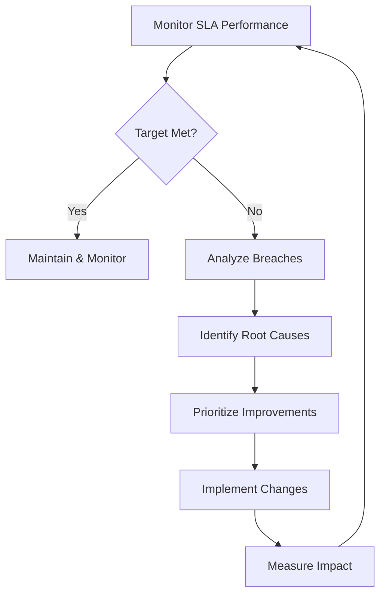

# Управление SLA (SLA Management)

## Обязательные правила вывода
- Всегда отвечай **на русском**.
- Сохраняй артефакты в `outputs/technical-support-director/skills/sla-management/{timestamp}_{кратко}.md` через Write tool; обновляй один файл по итерациям.
- Формат: цель/контекст → требования/метрики → договор/процессы → алерты/эскалации → TODO → изменения vs прошлой версии.

## 3-итерационный контур
1) **Диагностика (1–2 ч):** текущие SLA/SLO, фактическое выполнение, штрафы/кредиты, каналы/эскалации, боли клиентов. Черновой бриф + risk/decision log.
2) **Дизайн (2–3 ч):** целевые SLO/OLA, метрики/пороговые значения, процессы измерения/репортинга, алерты/эскалации, кредитная политика, коммуникации. Таблицы SLA/SLO/OLA, RACI.
3) **Верификация (1–2 ч):** пилот/внедрение, мониторинг, пересмотр по данным, обновление логов/TODO/изменений.
## Когда Использовать

- Разработка SLA для новых support tiers
- Мониторинг SLA compliance
- Расчет service credits
- Анализ SLA breaches
- Оптимизация processes для достижения targets

## Ключевые Метрики

### Response Time SLA
```markdown
## Целевые Значения

| Priority | Target | Measurement Start | Business Hours |
|----------|--------|-------------------|----------------|
| P1 | 15 минут | Ticket creation | 24/7 |
| P2 | 30 минут | Ticket creation | 24/7 |
| P3 | 2 часа | Ticket creation | Business hours |
| P4 | 8 часов | Ticket creation | Business hours |

## Compliance Target
- Общий compliance: ≥98%
- P1 compliance: ≥99%
- Monthly review и improvement plan
```

### Availability SLA
```python
# Downtime Budget Calculation

AVAILABILITY_TARGETS = {
    "99.9%": {
        "monthly_downtime": "43.2 minutes",
        "annual_downtime": "8.76 hours"
    },
    "99.95%": {
        "monthly_downtime": "21.6 minutes",
        "annual_downtime": "4.38 hours"
    },
    "99.99%": {
        "monthly_downtime": "4.32 minutes",
        "annual_downtime": "52.56 minutes"
    }
}

def calculate_availability(uptime_minutes, total_minutes):
    """
    Расчет availability percentage
    """
    return (uptime_minutes / total_minutes) * 100

def calculate_service_credit(availability, target, monthly_fee):
    """
    Расчет service credits за SLA breach
    """
    if availability >= target:
        return 0

    breach = target - availability  # e.g., 99.95 - 99.85 = 0.10%
    credit_units = breach / 0.1  # Number of 0.1% units breached

    # 10% credit per 0.1% breach
    credit_rate = 0.10
    credit = monthly_fee * credit_rate * credit_units

    return min(credit, monthly_fee)  # Cap at 100%
```

## Мониторинг и Alerting

### Alert Configuration
```yaml
# SLA At-Risk Alerts

alerts:
  p1_response_at_risk:
    condition: "ticket_age > 10 minutes AND priority=P1 AND status=NEW"
    action:
      - notify: ["sms", "pagerduty"]
      - recipients: ["on-call", "team-lead"]
      - auto_escalate: true

  p1_response_breach:
    condition: "ticket_age > 15 minutes AND priority=P1 AND status=NEW"
    action:
      - notify: ["sms", "pagerduty", "email"]
      - recipients: ["on-call", "team-lead", "director"]
      - escalate_to: "senior_engineer"

  sla_trending_down:
    condition: "weekly_compliance < 96% OR 3_week_decline"
    action:
      - notify: ["email", "slack"]
      - recipients: ["team-leads", "director"]
      - request: "improvement_plan"
```

## Breach Analysis

### Categorization Matrix
```markdown
## Причины SLA Breaches

### Staffing Issues (30-40%)
- Insufficient coverage
- Shift handoff delays
- Vacation/sick leave gaps
- Skills mismatch

**Remediation**:
- Adjust staffing levels
- Improve handoff process
- Cross-training programs
- Hire/reallocate resources

### Technical Complexity (25-35%)
- Novel/unknown issues
- Multi-service dependencies
- Missing documentation
- Access delays

**Remediation**:
- Create runbooks
- Expand knowledge base
- Pre-provision access
- Technical training

### Process Inefficiency (15-25%)
- Slow escalation
- Approval bottlenecks
- Unclear ownership
- Tool limitations

**Remediation**:
- Streamline escalation
- Delegate authority
- Clarify responsibilities
- Tool improvements

### External Dependencies (10-15%)
- Vendor response delays
- Customer delays
- Third-party service issues

**Remediation**:
- Improve vendor SLAs
- Set customer expectations
- Backup procedures
```

## Reporting

### Monthly SLA Report Template
```markdown
# SLA Performance Report - [Month Year]

## Executive Summary
- **Overall Compliance**: X%
- **Trend**: [↑↓→] vs last month
- **Service Credits Issued**: $X,XXX
- **Top Improvement**: [Achievement]

## Metrics

### Response Time
| Priority | Target | Actual | Compliance | Breaches |
|----------|--------|--------|------------|----------|
| P1 | 15min | 12min | 98.5% ✅ | 3 |
| P2 | 30min | 28min | 97.2% ✅ | 7 |

### Availability
- **Target**: 99.95%
- **Actual**: 99.97% ✅
- **Downtime**: 12.96 min (budget: 21.6 min)

## Root Cause Analysis
[Top 3 breach causes with remediation plans]

## Action Items
[Prioritized improvements for next month]
```

## Continuous Improvement

### SLA Optimization Process


## References
- `sla-templates/` - SLA contract templates
- `dashboards/` - Grafana/Datadog dashboard configs
- `calculators/` - Service credit calculation scripts
